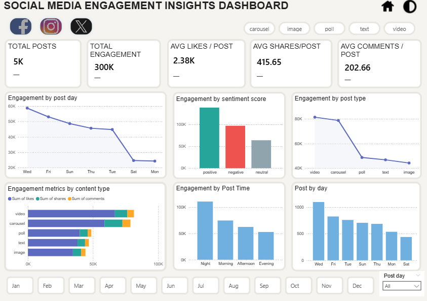

# Social Media Engagement Insights Dashboard

A Power BI dashboard built on the [Social Media Engagement](https://www.kaggle.com/datasets/divyaraj2006/social-media-engagement) public dataset by divyaraj2006.

## Preview

## Features
- Light and dark mode versions
- Dynamic prior period delta indicators on all KPI cards
- Platform, post type and month filters
- Time intelligence DAX measures

## Tools
- Microsoft Power BI Desktop
- DAX
- Power Query

## Links
- [Kaggle Notebook](https://www.kaggle.com/code/benjaminmawulolo/notebook14e1c5c9ca)
- [Dataset Source](https://www.kaggle.com/datasets/divyaraj2006/social-media-engagement)
